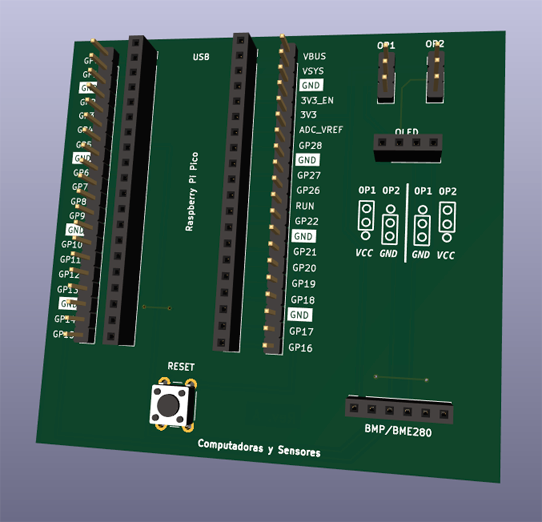

# Pico Carrier

Un placa de desarrollo simple para Raspberry Pi Pico/W que incorpora la posibilidad de conectar una pantalla OLED SSD1306 (con jumpers para diferentes variantes de alimentación) y un sensor ambiental BMP/BME280.
También expone todos los GPIO de la placa para una fácil conexión de dispositivos adicionales y un pulsador de reset.

Todos los archivos de diseño en Kicad se encuentran publicados junto a un código de ejemplo en MicroPython

# Fabricación

Dentro de la carpeta `fab` encontrarás el archivo `Pico-Carrier-Fab.zip` que incluye los Gerber y archivos de perforación .drl todo listo para ordenar a tu fabricante de PCB favorito.

# Paso a paso

La explicación completa la podrás ver en el siguiente video de Youtube:
https://youtube.com/c/computadorasysensores
